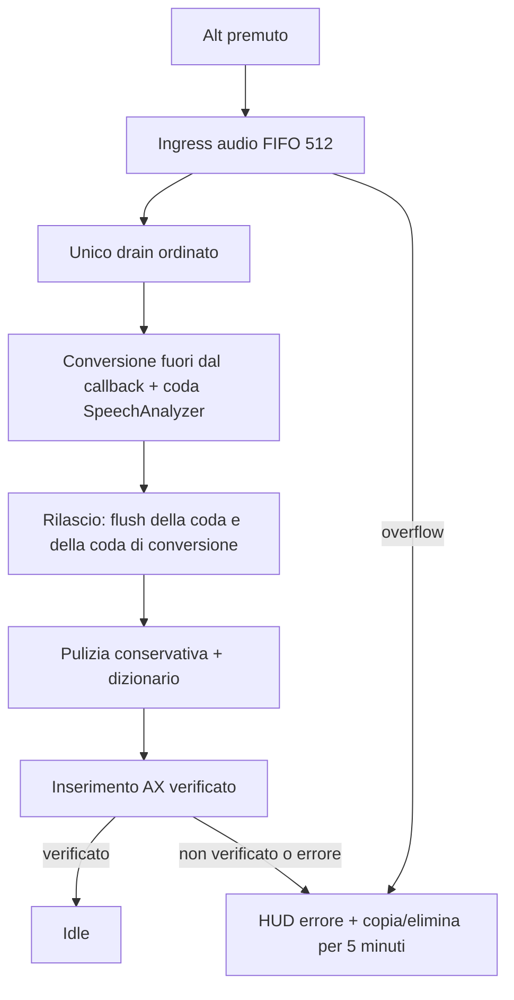

# WisperClone

**Parla. È già scritto.**

WisperClone è una dettatura push-to-talk nativa per macOS 26. Tieni premuto il tasto configurato, parla e rilascialo: la voce viene trascritta sul dispositivo, ripulita e inserita nel campo attivo.

## Privacy

Il percorso di produzione è locale:

- `SpeechAnalyzer` / `SpeechTranscriber` di Apple trascrivono sul Mac;
- il formatter deterministico non usa la rete;
- la pulizia intelligente opzionale usa Apple Foundation Models sul dispositivo;
- audio e trascrizioni non vengono persistiti né registrati nei log;
- non sono presenti integrazioni cloud o con altre app di dettatura.

Il dizionario personale è l'unico contenuto persistente ed è conservato in:

```text
~/Library/Application Support/WisperClone/dictionary.txt
```

## Requisiti

- macOS 26 o successivo;
- Xcode 26 o successivo per compilare;
- autorizzazioni Microfono e Accessibilità per la dettatura.

Il progetto usa il runtime Xcode installato in `/Applications/Xcode.app`. Se la selezione globale punta alle sole Command Line Tools, usa un override per comando:

```bash
DEVELOPER_DIR=/Applications/Xcode.app/Contents/Developer make build
```

## Avvio e installazione

Per compilare e assemblare l'app release nella cache locale:

```bash
DEVELOPER_DIR=/Applications/Xcode.app/Contents/Developer make app
```

Per installarla in `/Applications` e avviarla:

```bash
DEVELOPER_DIR=/Applications/Xcode.app/Contents/Developer make install
```

`make app` applica, nell'ordine, un certificato Developer ID, un certificato Apple Development oppure una firma ad hoc. Una firma stabile aiuta a mantenere le autorizzazioni TCC dopo le ricompilazioni; una build ad hoc può richiedere nuovamente Accessibilità.

L'avvio al login è un'impostazione esplicita in WisperClone → Impostazioni → Avvia WisperClone all'accesso. Lo stato mostrato proviene da `SMAppService.mainApp`, quindi può anche risultare in attesa di approvazione nelle impostazioni di macOS. Il flag `--enable-login-item` abilita questa scelta solo quando viene passato esplicitamente durante l'installazione o l'avvio; l'app non si registra automaticamente.

Alla prima apertura l'onboarding guida la concessione di Accessibilità e Microfono e la scelta del tasto push-to-talk.

## Architettura e comportamento verificato



L'acquisizione parte prima della preparazione completa del motore, così il parlato immediato dopo Alt entra nella coda. Non esiste più una soglia fissa di 350 ms: le sessioni brevi vengono finalizzate quando contengono audio. Le due code FIFO hanno capacità 512 e l'overflow è riportato visibilmente. Il converter opera fuori dal callback audio e invia anche il tail al rilascio.

La pulizia intelligente è soggetta a timeout e a una validazione conservativa; in caso di parole eliminate, aggiunte o riordinate, oppure timeout viene usato il formatter deterministico. Il dizionario è persistito in modo transazionale e mantiene watcher per sostituzioni e scritture dirette. La capitalizzazione gestisce anche espansioni Unicode come `ß` → `SS`.

L'HUD resta un pannello `.nonactivatingPanel` e non diventa key window, per preservare il campo di inserimento. Il fallback clipboard è usato solo dopo la verifica del movimento del caret; quando l'inserimento non è verificabile il testo rimane recuperabile in memoria per cinque minuti dal menu della barra.

## Test e verifica

Test Swift:

```bash
DEVELOPER_DIR=/Applications/Xcode.app/Contents/Developer swift test \
  --scratch-path "$HOME/Library/Caches/WisperCloneBuild/tests"
```

Build e firma:

```bash
DEVELOPER_DIR=/Applications/Xcode.app/Contents/Developer make app
codesign --verify --deep --strict \
  "$HOME/Library/Caches/WisperCloneBuild/WisperClone.app"
```

La verifica automatica eseguita per la release 0.3.0 (build 12) ha superato 29 test in 8 suite, oltre a build release e verifica della firma. I test coprono ingress audio, conversione e flush, controller, dizionario, pulizia e Unicode; non possono provare microfono reale, tasto Alt fisico, stato TCC, mantenimento del focus o inserimento in processi esterni.

La validazione manuale voce → testo resta necessaria in TextEdit, Note, un browser e un editor Electron, includendo una parola breve e una dettatura immediata dopo Alt. La verifica di login richiede un nuovo accesso a macOS; non è sostituita dal solo stato letto dall'app.

## Identità e rollback

Il bundle ID, il nome dell'eseguibile e il percorso di installazione restano stabili:

```text
com.andreavisini.wisperclone.app
/Applications/WisperClone.app
```

Il rollback previsto usa la copia firmata precedente nella cache locale, se presente:

```text
/Users/andreavisini/Library/Caches/WisperCloneBuild/rollback/WisperClone-0.2.9.app
```

La release 0.3.0 è preparata per il branch `feature/wisperclone-onboarding` e il tag `wisperclone-v0.3.0`; la pubblicazione e l'installazione finale devono essere verificate separatamente.
