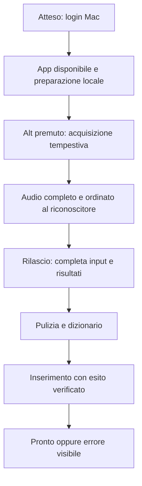
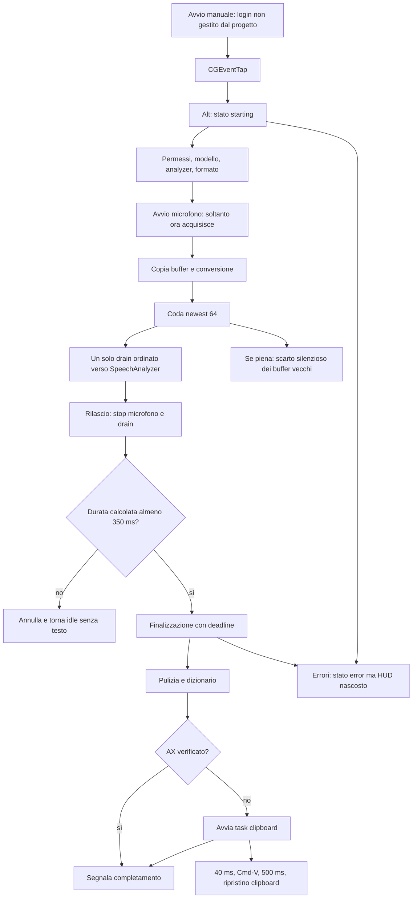

# Audit WisperClone — 11 settembre 2026

## Esito e perimetro

Il progetto compila e supera i test esistenti, ma non è privo di problemi. Il percorso di avvio della cattura spiega strutturalmente la perdita delle parole pronunciate immediatamente dopo Alt. La latenza effettiva sul microfono di Andrea non è stata misurata.

Audit sul repository canonico, HEAD `043b63b`, inizialmente pulito. Esaminati controller, hotkey, audio, trascrizione, inserimento, formattazione, dizionario, UI, permessi, packaging e test. Review indipendente in sola lettura del percorso audio/hotkey. Nessuna modifica al codice, alle preferenze, ai permessi o all'app installata; questo rapporto è l'unico file aggiunto.

## Flusso atteso e osservato

Differenze materiali: intervallo iniziale senza cattura, filtro sulle dettature brevi, perdita possibile nella coda, successo anticipato rispetto all'incollaggio, errori non visibili nell'HUD. Questi scostamenti impediscono un esito end-to-end positivo basato soltanto sulla build.

## Finding prioritizzati

### 1. P1 — Audio iniziale non acquisito durante la preparazione

**Prova:** `Sources/WisperClone/Core/DictationController.swift:141-186`: prima vengono attesi permessi, `engine.start()` e formato, poi viene chiamato `capture.start`. `AppleSpeechEngine.swift:31-89` prepara il riconoscitore e può installare il modello. Il motore viene creato per la sessione; non c'è preparazione preventiva nel percorso di avvio dell'app.

**Effetto:** parlare subito dopo Alt perde tutto ciò che precede l'avvio effettivo del microfono. Rilasciare durante la preparazione può produrre una sessione senza audio. È una causa concreta compatibile con il sintomo; non dimostra che ogni parola mancante dipenda da questa sola causa.

**Direzione della correzione:** separare preparazione del modello e acquisizione, preparare quanto possibile prima della pressione senza aprire il microfono a riposo, preservare l'audio durante l'avvio del riconoscitore e rendere visibile lo stato di disponibilità. Misurare press → primo buffer, a freddo e a caldo, senza registrare audio o testo nei log. Validare parlato immediato e rilascio durante startup.

### 2. P1 — Le sessioni brevi vengono scartate integralmente

**Prova:** `DictationController.swift:266-290` richiede almeno `0.35` secondi dalla data `listeningStartedAt`; in caso contrario cancella il motore e torna idle senza inserire nulla. La data viene impostata soltanto dopo l'avvio della cattura, riga 189.

**Effetto:** una parola breve, per esempio «sì», può essere eliminata anche se l'utente ha rispettato pressione, parlato e rilascio. Il tempo iniziale perso nella preparazione peggiora il caso. Inoltre la durata è valutata dopo il drain, quindi include attesa successiva allo stop e non misura rigorosamente la quantità di audio acquisita.

**Direzione:** distinguere rumore e dettatura utilizzabile senza sopprimere automaticamente tutte le sessioni brevi. Testare una breve parola valida, un tap senza parlato e una frase normale con motore simulato; poi verificare sul microfono.

### 3. P2 — Avvio al login non implementato

**Prova:** non ci sono registrazione di login item, `ServiceManagement`/`SMAppService`, preferenze o controllo UI dedicati nel progetto. `WisperCloneApp.swift:31-44` inizializza soltanto l'app già lanciata. Nessun riferimento WisperClone trovato nei LaunchAgent/Daemon esaminati né nell'output filtrato di `sfltool dumpbtm`.

**Effetto:** il progetto non garantisce che l'app parta all'accesso. Il sintomo riferito è coerente; non è stato eseguito un logout/riavvio e il controllo del sistema non sostituisce quella prova.

**Direzione:** implementare un'opzione di avvio al login con stato reale del sistema, preservando identità e percorso dell'app. Richiede successiva verifica dopo accesso al Mac.

### 4. P2 — La coda può perdere audio senza segnalarlo

**Prova:** `DictationController.swift:170-183` usa `.bufferingNewest(64)` e ignora il risultato di `continuation.yield`. Se il consumatore resta indietro, gli elementi vecchi vengono scartati.

**Effetto:** sotto carico possono mancare segmenti interni della frase senza errore. È confermato il ramo di perdita nel codice; non è stato riprodotto un overflow durante una dettatura reale. Il drain singolo preserva l'ordine dei buffer rimasti, non la completezza.

**Direzione:** definire limiti e comportamento esplicito di sovraccarico, contare gli scarti senza contenuti sensibili e testare il produttore con un consumatore artificialmente lento.

### 5. P2 — Completamento anticipato e perdita silenziosa nel fallback clipboard

**Prova:** `TextInjector.swift:114-143` avvia un task e ritorna prima del Cmd-V. `DictationController.swift:319-321` riproduce subito il suono e azzera la sessione. Se la clipboard cambia nei primi 40 ms, l'incollaggio viene annullato e l'unico riscontro è nel log. Anche la creazione degli eventi può fallire senza esito restituito al controller (`TextInjector.swift:146-152`).

**Effetto:** il suono può indicare successo senza testo inserito; il testo già dettato viene eliminato dallo stato. I 500 ms per il ripristino sono un'attesa fissa, non una ricevuta dell'app destinataria.

**Direzione:** restituire un esito asincrono, distinguere invio del comando da inserimento verificato, mostrare il fallimento e consentire recupero temporaneo in memoria. Verificare anche applicazioni lente e cambio clipboard, senza perdere gli appunti dell'utente.

### 6. P2 — Errori invisibili nell'uso dalla barra menu

**Prova:** `DictationController.State.isActive` esclude `.error`; `WisperCloneApp.swift:58-61` nasconde l'HUD quando lo stato non è attivo. `HUDView` contiene una presentazione d'errore che quindi non rimane mostrata. `DictationController.swift:397-405` torna idle dopo tre secondi.

**Effetto:** con finestra principale chiusa, un problema del microfono o riconoscitore può apparire come una dettatura scomparsa. La finestra principale mostra invece il messaggio se aperta.

**Direzione:** gestire separatamente visibilità dell'HUD e attività di registrazione; mostrare un errore leggibile mantenendo il pannello non attivante.

### 7. P2 — Errori di salvataggio del dizionario ignorati

**Prova:** `DictionaryStore.swift:135-142` aggiorna stato/revisione ma usa `try?` per scrivere il file. I caller aggiornano subito le voci in memoria.

**Effetto:** una scrittura fallita può sembrare riuscita e perdere le modifiche al prossimo avvio. Nessun guasto del disco è stato simulato e nessun dizionario personale è stato modificato.

**Direzione:** rendere l'errore visibile e mantenere esplicito lo stato non salvato; testare una destinazione non scrivibile in directory temporanea.

### 8. P2 — Capitalizzazione non valida per alcuni caratteri Unicode

**Prova:** `Sources/WisperFormatting/TextFormatter.swift:78` costruisce `Character(character.uppercased())`. Un controllo Swift isolato ha restituito `a → A, count 1`, `ß → SS, count 2`, `ffi → FFI, count 3`. L'interfaccia della standard library installata, `Character.init(String)`, richiede un solo grapheme cluster tramite debug precondition.

**Effetto:** input di questo tipo a inizio frase viola il contratto di `Character` e può provocare un trap nelle build debug. Non è stato provocato un crash dell'app installata né affermato un crash release verificato.

**Direzione:** aggiungere alla stringa il risultato della capitalizzazione come stringa; testare espansioni Unicode e normali iniziali italiane.

## Altri limiti e conformità

- Il formatter intelligente ammette output con rapporto di parole di contenuto fino a soli 0.35 rispetto all'input depurato dai filler (`FoundationModelFormatter.swift:166-169`): non garantisce conservazione del contenuto. È opzionale e nelle preferenze lette non risulta abilitato; il default è false, quindi non è la spiegazione primaria del sintomo attuale. Il timeout con task group dipende dalla cooperazione alla cancellazione del framework e non è stato cronometrato.
- La cattura viene fermata al rilascio. La conservazione dell'ultima sillaba e dei buffer ancora in lavorazione richiede prova fisica; non attribuita a un difetto confermato senza riproduzione.
- Il dizionario osserva l'inode del file: una cancellazione seguita da ricreazione differita può interrompere il watcher. Da verificare con file isolato, prima di correggere.
- `HUDView.swift:3-30` usa un gradiente blu/viola in contrasto con il contratto visivo «no gradients» e rosso per registrazione; difetto secondario rispetto alla perdita del parlato.
- App installata: versione 0.2.9, build 11, bundle ID corretto, firma **ad hoc**, verifica firma valida. Questo non prova stabilità dei permessi TCC dopo una ricompilazione. Non modificata la firma o l'installazione.
- Nel codice esaminato non sono presenti servizi cloud di trascrizione né salvataggio intenzionale di audio/trascrizioni. Copia dei buffer, drain singolo, lingua italiana predefinita, rifiuto della lingua non supportata e HUD non attivante rispettano i contratti principali. Il fallback clipboard è temporaneo ma usa gli appunti di sistema; nessun audit dei gestori clipboard esterni.
- I log applicativi mostrano conteggi e stati; gli errori del framework passati come descrizione libera non sono stati verificati per ogni possibile contenuto. Non equivale a un audit di traffico o dei framework Apple.

## Verifiche eseguite

| Controllo | Risultato |
|---|---|
| `DEVELOPER_DIR=/Applications/Xcode.app/Contents/Developer swift test --scratch-path "$HOME/Library/Caches/WisperCloneBuild/tests"` | PASS: 8 test, 2 suite Swift Testing; include vettori condivisi dizionario |
| `DEVELOPER_DIR=/Applications/Xcode.app/Contents/Developer make build` | PASS: build release |
| `codesign --verify --deep --strict /Applications/WisperClone.app` | PASS sull'app già installata |
| Stato iniziale Git e `git diff --check` | Pulito / PASS |
| Preferenze e metadati installazione | Alt destro; onboarding completato; 0.2.9 build 11, firma ad hoc |
| Prova Unicode isolata | Confermate espansioni a più caratteri |
| Dettatura reale, tasto fisico, TCC, destinazioni esterne, login | NON ESEGUITI |

I test attuali coprono formattazione deterministica e dizionario, non controller, hotkey, audio, persistenza, formatter intelligente o inserimento tra processi. Un PASS di queste suite non certifica la dettatura end-to-end. L'app non risultava in esecuzione nel campione processi iniziale; non è stata avviata per non interferire con la sessione dell'utente.

## Ordine suggerito per il lavoro successivo

1. Acquisizione iniziale, dettature brevi e coda audio: controlli con motore simulato, poi misurazione locale senza contenuti e dettatura immediata dopo Alt.
2. Avvio al login e disponibilità effettiva del motore.
3. Esito d'inserimento, errori visibili e recupero in memoria.
4. Persistenza dizionario, Unicode e conformità HUD.

Dopo le correzioni materiali: installare con strategia di firma concorde al progetto e verificare dettatura breve italiana in TextEdit, Note, browser ed editor Electron; includere prima parola immediata, ultima sillaba, «sì/no», seconda sessione rapida e stato dopo login. Le ulteriori problematiche segnalate da Andrea potranno modificare questa priorità.
