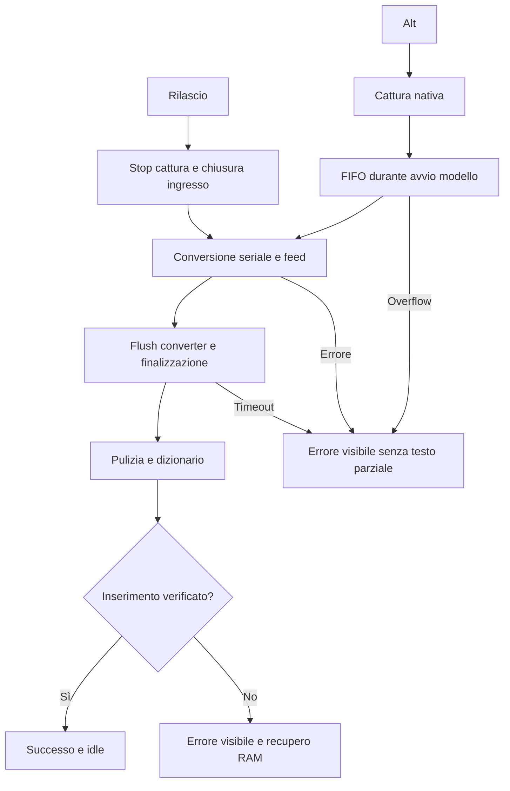

# Audit dopo pubblicazione — WisperClone 0.3.0

11 settembre 2026. Esito: correzioni del codice verificate, release pubblicata e installata; permessi ripristinati e hotkey attiva. Collaudo con voce e tasto fisico ancora da eseguire.

## Artefatto verificato

- Release pubblica: https://github.com/Floyd14/murmur-youtube/releases/tag/wisperclone-v0.3.0
- Commit applicativo: `976c27bae13a400a6eb2607d055843a7df2cc466`, branch `feature/wisperclone-onboarding` del fork `Floyd14/murmur-youtube`.
- Tag annotato `wisperclone-v0.3.0`, risolto dal remoto allo stesso commit.
- Release GitHub non draft, pubblicata alle 18:38:26 UTC; entrambi gli asset risultano `uploaded`.
- ZIP Apple Silicon: `WisperClone-0.3.0-macOS-arm64.zip`, 670841 byte.
- SHA-256 ZIP locale e digest restituito da GitHub concordano: `6e0f375f027f0a66c5f7d9f57088ddaba392a27fc050bb10c2d7fa8f6be0fec6`.
- App installata: `/Applications/WisperClone.app`, versione 0.3.0, build 12; processo avviato da quel percorso.
- SHA-256 dell'eseguibile installato e dell'eseguibile assemblato concordano: `d83428bda2546ce5b8a7d22715d7c35f3cbb4f6505cd35e2e7c0249e9e6bbc94`.
- `codesign --verify --deep --strict` supera il controllo sull'app installata. Firma ad hoc, identità `com.andreavisini.wisperclone.app`, nessuna notarizzazione introdotta.
- Nessuna differenza tra il tag pubblicato e il checkout per Sources, Tests, Package.swift e Resources al momento di questa verifica.

## Confronto con l'audit iniziale

| Finding iniziale | Correzione | Evidenza / limite |
|---|---|---|
| Avvio audio dopo il modello | Acquisizione nativa prima di `engine.start`, conversione sul drain ordinato | Test con startup sospeso: audio iniziale e ordine conservati anche dopo il rilascio |
| Soglia 350 ms | Rimossa; finalizzazione basata su presenza di audio | Una dettatura simulata di 10 ms raggiunge l'inseritore |
| Nessun avvio al login | `SMAppService.mainApp`, opzione e stato reale | UI installata: toggle on, stato **ATTIVO**; accesso fisico successivo non eseguito |
| Scarti silenziosi | FIFO bounded 512 e gestione esplicita di overflow, anche nell'ingresso di SpeechAnalyzer | Test capienza ridotta: errore visibile e zero inserimenti parziali |
| Successo prima del paste | Esito asincrono e verifica caret/focus; su fallimento o mancata verifica, recupero RAM per 5 minuti | Test attesa inseritore e completamento tardivo; AX/Cmd-V reali ancora esclusi |
| Errori HUD nascosti | Stato error mantiene visibile il pannello; niente timeout UI che cancelli il messaggio | Contratto `showsHUD` e review; resa visiva completa dell'errore da provare dal vivo |
| Salvataggi dizionario ignorati | Commit transazionale, errori osservabili, editor conserva bozza; watcher directory + inode | Test scrittura fallita, delete/recreate e scrittura diretta |
| Maiuscole Unicode | Append della stringa capitalizzata, senza costruzione invalida di Character | Regressioni Unicode ed espansione ß → SS |

Ulteriori punti sistemati: flush della coda del converter, errore su cambio di formato, cleanup conservativo che preserva parole/negazioni/numeri e ordine, timeout del cleanup senza attesa strutturata del task perdente, errori del framework non loggati come testo libero, forma d'onda rossa senza gradiente. La verifica della pulizia conserva token alfanumerici e non costituisce una prova semantica di ogni possibile punteggiatura.

## Diagramma atteso e riscontro

I test simulati coincidono con i rami del diagramma relativi ad avvio, rilascio, coda, conversione, finalizzazione, cancellazione e consegna asincrona. Non sono una prova di riconoscimento vocale o di consegna effettiva fra processi. Nessun nuovo finding bloccante di codice è emerso nella review indipendente del diff stabile.

## Controlli eseguiti

- Suite integrata finale: **29 test, 8 suite, PASS**.
- QA indipendente: timeout senza inserimento, cancellazione durante startup e nuova sessione, completamento obsoleto che non modifica la nuova sessione; **3/3 PASS**. Dizionario: **2/2 PASS**.
- `make app` release: PASS; plist e firma: PASS; `git diff --check`: PASS.
- Review indipendente unica: PASS, senza finding materiali.
- Dopo pubblicazione: rilettura API GitHub, risoluzione tag/branch remoto, hash ZIP, versione/build/hash/firma/processo installato e confronto del codice col tag.
- UI dell'app installata aperta tramite controllo nativo: versione **0.3.0** e login **ATTIVO** osservati.

## Ripristino operativo e verifiche non eseguite

La verifica iniziale ha mostrato permessi non concessi. Dopo autorizzazione esplicita di Andrea e autenticazione locale macOS, è stata rimossa la sola vecchia voce WisperClone da Accessibilità e aggiunta la copia in `/Applications/WisperClone.app`. Il semplice off/on e riavvio non avevano risolto il disallineamento. La schermata dell’app ora conferma **Accessibilità CONCESSO**, **Microfono CONCESSO**, login **ATTIVO**. Il log del processo installato riporta l’attivazione del monitor hotkey alle **20:47:16 locali**. Nessun reset globale o modifica diretta del database TCC; nessun permesso delle altre app modificato.

Restano da eseguire:

1. prova italiana con Alt fisico, parlato immediato, parola breve e ultima sillaba;
2. inserimento in TextEdit, Note, browser ed editor Electron;
3. nuovo accesso al Mac per provare l'avvio al login, distinto dalla sola registrazione attiva.

La copia 0.2.9 per rollback è conservata e la sua firma è stata verificata nella cache di build. Il registro di manutenzione è stato aggiornato e pubblicato separatamente con il nuovo login item (commit `02188be`), preservando modifiche preesistenti. Il tentativo di audit globale del registro è stato fermato dopo 60 secondi: l'inventario globale non è stato dichiarato aggiornato.

Riferimento per il contratto di registrazione al login: [Apple SMAppService](https://developer.apple.com/documentation/servicemanagement/smappservice).
