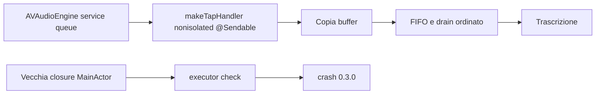

# WisperClone 0.3.1

Stato: hotfix build 13 compilata, firmata e installata. La prova live di acquisizione e arresto del microfono passa; il collaudo con Alt fisico e voce → testo resta separato.

## Correzione principale

La 0.3.0 poteva terminare quando AVAudioEngine invocava il callback audio dal proprio service queue. Il callback era creato dentro il percorso `@MainActor` di `AudioCapture.start`, quindi ereditava un executor incompatibile con il contesto reale di AVFAudio.

La 0.3.1 crea l'handler tramite `AudioCapture.makeTapHandler()`, dichiarato `nonisolated`, con tipo `@Sendable`. L'handler può quindi essere eseguito dalla coda audio senza imporre il MainActor; il buffer continua a essere copiato prima di attraversare il confine asincrono.



## Evidenze

- `audioTapCanRunOffMainActor`: PASS; invoca l'handler di produzione da `Task.detached`.
- Suite completa: **30 test in 8 suite, PASS**.
- Build release e `codesign --verify --deep --strict`: PASS, anche sulla copia installata.
- Review indipendente mirata: PASS.
- App installata: `/Applications/WisperClone.app`, 0.3.1 build 13. Hash SHA-256 eseguibile installato e assemblato: `00eae354b69ec605903505df87774b75585771468e96785cbe3b32221217513a`.
- UI: avvio al login ATTIVO e Accessibilità CONCESSO dopo ripristino della sola voce WisperClone; monitor hotkey attivato alle 21:06:09. Il nuovo login non è stato eseguito.
- Dopo consenso al microfono: acquisizione reale e avvio SpeechAnalyzer osservati alle 21:07:22 e 21:08:21. Secondo avvio cattura: 0,475 secondi; motore avviato alle 21:08:21,426. UI IN ASCOLTO e poi PRONTO dopo Stop, stesso processo 25346 ancora vivo; nessun nuovo crash nel controllo. Nessun audio o testo archiviato per la verifica.
- Report del crash osservato sulla 0.3.0: `WisperClone-2026-09-11-205528.ips` locale; il contenuto grezzo non è incluso né pubblicato.

## Limiti ancora aperti

Non sono ancora attestati per questa build: Alt fisico e trascrizione di una frase parlata, inserimento in TextEdit/Note/browser/editor Electron e avvio dopo un nuovo login macOS. I test automatici verificano il contratto del callback e le regressioni simulate, non la sessione completa fra processi.

La build mantiene l'identità `com.andreavisini.wisperclone.app` e il percorso `/Applications/WisperClone.app`. Il rollback previsto, se necessario, è:

```text
/Users/andreavisini/Library/Caches/WisperCloneBuild/rollback/WisperClone-0.2.9.app
```
